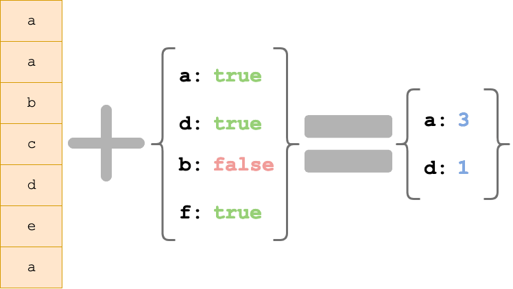

# Lotide

A mini clone of the [Lodash](https://lodash.com) library. 

## Purpose

**_BEWARE:_ This library was published for learning purposes. It is _not_ intended for use in production-grade software.**

This project was created and published by me as part of my learnings at Lighthouse Labs. 

## Usage

**Install it:**

`npm install @rahmatsaeedi/lotide`

**Require it:**

`const _ = require('@rahmatsaeedi/lotide');`

**Call it:**

`const results = _.tail([1, 2, 3]) // => [2, 3]`

## Documentation

The following functions are currently implemented:

* [`assertEqual(actual, expected, suppressLogging = false)`](assertEqual.js): A custom assert function with emoji icons. Returns a Boolean value.
  ```js
  assertEqual("Bootcamp", "Bootcamp")
  // => ✅  Assertion Passed: Bootcamp === Bootcamp
  // => true
  assertEqual(1, 1)
  // => ✅  Assertion Passed: 1 === 1
  // => true
  ```
* [`countLetters(string)`](countLetters.js): Returns an object containing count of every character in an input string. The 

* [`countOnly(array, object)`](countOnly.js): Takes in a collection of items and return an object containing counts of everything that the input object listed.
  
  ```js
  // Given
  const firstNames = [
    "Karl",
    "Salima",
    "Agouhanna",
    "Fang",
    "Kavith",
    "Jason",
    "Salima",
    "Fang",
    "Joe"
  ];

  countOnly(firstNames, { "Jason": true, "Karima": true, "Fang": true });
  // => { Jason: 1, Fang: 2 }
  ```
* [`eqArrays(array1, array2)`](eqArrays.js): Takes in two arrays and returns `true` or `false`, based on a perfect match. It also works with nested arrays.
 
* [`eqObjects(object1, object2)`](eqObjects.js): Take in two objects, checks whether that the two are identical, and returns a boolean.
Supports nested objects with premitive values, and nested arrays.
  ```js
  eqObjects({ x: 1, y: 2, z: 'w' }, { x: 1, y: 2, z: 'w' }); // => true
  eqObjects({ y: 2, x: 1, z: 'w' }, { x: 1, y: 2, z: 'w' }); // => true
  eqObjects({ x: 1, y:{y: [[2, [2]]], z: {m:'w'}}}, { x: 1, y:{y: [[2, [2]]], z: {m:'w'}} }); // => true
  eqObjects({ x: 1, y: 2, z: 'w' }, { x: 1, y: 2, z: 'w', zz:'zz' }); // => false
  ```

* [`findKey(object, predicate)`](findKey.js): This method returns the key of the first element predicate returns truthy. Predicate takes (object[key], key, object).

  ```js
  findKey({
    "Blue Hill": { stars: 1 },
    "Akaleri":   { stars: 3 },
    "noma":      { stars: 2 },
    "elBulli":   { stars: 3 },
    "Ora":       { stars: 2 },
    "Akelarre":  { stars: 3 }
  }, x => x.stars === 2); // => "noma"
  ```
* [`findKeyByValue(object, value)`](findKeyByValue.js): Searches for a key in an object where its value matches a given value.
  ```js
  const bestTVShowsByGenre = {
    sciFi: "The Expanse",
    comedy: "Brooklyn Nine-Nine",
    drama:  "The Wire",
    drama2:  "The Wire"
  };

  findKeyByValue(bestTVShowsByGenre, "The Wire");
  // Returns:  'drama'

  findKeyByValue(bestTVShowsByGenre, "That '70s Show");
  // Returns:  undefined
  ```

* [`findKeysByValue(object, value)`](findKeysByValue.js): Searches for keys in an object where its value matches a given value. Returns an array.
  ```js
  const bestTVShowsByGenre = {
    sciFi: "The Expanse",
    comedy: "Brooklyn Nine-Nine",
    drama:  "The Wire",
    drama2:  "The Wire"
  };

  findKeyByValue(bestTVShowsByGenre, "The Wire");
  // Returns:  [ 'drama', 'drama2' ]

  findKeyByValue(bestTVShowsByGenre, "That '70s Show");
  // Returns:  []
  ```
* [`flatten(array)`](flatten.js): Given an array with other arrays inside, this function can flatten it into a single-level array.
  ```js
  flatten([1, 2, [3, 4], 5, [6]]) // => [1, 2, 3, 4, 5, 6]

  flatten([1, 2, [3, [[[[4]] , 5]]], 6, [7, 8, 9, 10]])
  // => [ 1, 2, 3, 4, 5, 6, 7, 8, 9, 10]

  flatten(["1", ["2", ["3"]]]) // => [ '1', '2', '3' ]
  ```
* [`head(array)`](head.js): Returns the head of an array. Returns 'undefined' for empty array.
  ```js
  head([1, 2, 3]);
  // => 1

  head([]);
  // => undefined
  ```
* [`letterPositions(string)`](`letterPositions.js`): Returns an object, containing all the indices in the string where each character is found. Indicies are zero-based.
  ```js
  letterPositions("Hello hehehe");
  /* Returns
  {
    H: [ 0 ],
    h: [ 6, 8, 10 ],
    e: [ 1, 7, 9, 11 ],
    l: [ 2, 3 ],
    o: [ 4 ],
    ' ': [ 5 ]
  }
  */
  ```
* [`map(array, callBack)`](map.js): Returns a new array based on the results of callback function. <br/>
Requires:
  * An array to map
  * A callback function
  ```js
  const words = ["ground", "control", "to", "major", "tom"];
  let firstLetters = map(words, word => word[0]);
  // Returns: ['g','c','t','m','t']
  ```
* [`middle(array)`](middle.js): Takes in an array and return the middle-most element(s) of the given array.
  * For arrays with one or two elements, returns an empty array.
  * For arrays with odd number of elements, an array containing a single middle element is returned.
  * For arrays with an even number of elements, an array containing the two elements in the middle is returned.
  ```js
  middle([1]) // => []
  middle([1, 2]) // => []

  middle([1, 2, 3]) // => [2]
  middle([1, 2, 3, 4, 5]) // => [3]


  middle([1, 2, 3, 4]) // => [2, 3]
  middle([1, 2, 3, 4, 5, 6]) // => [3, 4]
  ```

* [`min(array)`](min.js): Returns the minimum of an array.
  ```js
    let testArray = [5, 7, -8, 2, 4, 0, 8, -1, 54, 13];
    min(testArray);
    // => -8
  ```
* [`tail(array)`](tail.js): Returns the tail of an array. ie, everything after the first element.
  ```js
  tail([1, 2, 3]);
  // => [2, 3]
  ```

* [`takeUntil(array, predicate)`](takeUntil.js): Creates a slice of array with elements taken from the beginning. Elements are taken until predicate returns falsey. The predicate is invoked with three arguments: (value, index, array).
  ```js
  const data1 = [1, 2, 5, 7, 2, -1, 2, 4, 5];
  const data2 = ["I've", "been", "to", "Hollywood", ",", "I've", "been", "to", "Redwood"];

  const results1 = takeUntil(data1, x => x < 0);
  const results2 = takeUntil(data2, x => x === ',');
  // results1 = [1, 2, 5, 7, 2]
  // results2 = ["I've", "been", "to", "Hollywood"]
  ```
* [`without(array, itemsToRemoveArray)`](without.js): Will return a subset of a given array, removing unwanted elements. 
  ```js
  without([1, 2, 3], [1]) // => [2, 3]
  without([1, 2, 1, 3, 1], [1]) // => [2, 3]
  without(["1", "2", "3"], [1, 2, "3"]) // => ["1", "2"]
  ```


